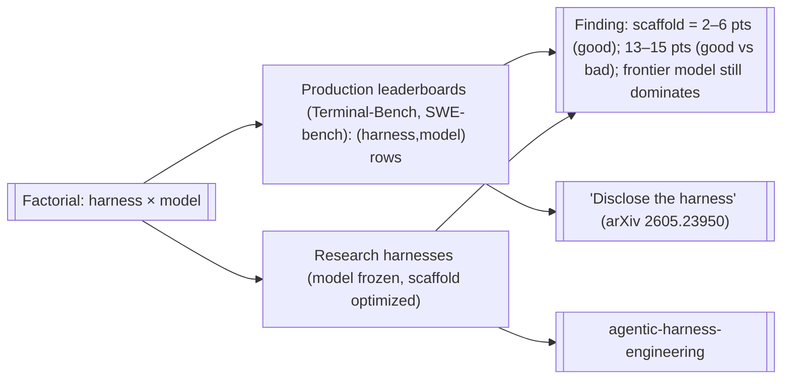

# Harness vs. Model: Performance Attribution

**The question:** does a study run the factorial — *agent A with model B, agent B with model A* — to separate the contribution of the **harness** (scaffold) from the **base model**? **Yes.** Agentic benchmark **leaderboards are exactly this grid**: each entry is a `(harness, model)` pair, so the same model appears under multiple harnesses and the same harness under multiple models. This page collects the production-level evidence and reconciles it with the wiki's research-harness factorials ([[agentic-harness-engineering]]).

> [!note] Two senses of "harness comparison"
> This page is the **measured performance** cut (who wins, and how much is the scaffold). For the **architectural** comparison of the five agents see [[cross-agent-comparison-2026]]; for the **component anatomy** see [[fundamental-components-of-harness]].

## Same model, different harness (scaffold effect)

Holding the **model fixed** and swapping only the harness, from the Terminal-Bench 2.0 leaderboard:

| Model (fixed) | Harness A | Harness B | Gap = scaffold effect |
|---|---|---|---|
| GPT-5.3-Codex | Factory **Droid** — 77.3% | OpenAI **Simple Codex** — 75.1% | **2.2 pts** |
| Claude Opus 4.6 | KRAFTON **Terminus-KIRA** — 74.7% | Bigai **TongAgents** — 71.9% | **2.8 pts** |
| (same weights) | LangChain agent — **66.5% (rank 5)** | their earlier scaffold — 52.8% | **13.7 pts** |

A bad-vs-good scaffold swing reaches **~13–15 pts**; a good-vs-good swing is typically **~2–6 pts**. [[stop-comparing-llm-agents-without-disclosing-the-harness-zhang-2026|Zhang et al. 2026]] quantify scaffold-only variation (model held fixed) at **11 pts for GPT-5 and 15 pts for Kimi K2 on SWE-bench Verified**, a **45.9%→55.4%** lift on SWE-bench Pro from swapping the SEAL scaffold for Claude Code, and HAL-leaderboard swings of **up to ~48 pts**. This matches the wiki's controlled result: [[agentic-harness-engineering-lin-2026|AHE]] lifts Terminal-Bench 2 from **69.7%→77.0%** with the model held fixed, beating human-designed Codex (71.9%).

## Same harness, different model

The inverse is cleanest on **provider-agnostic** harnesses. Because [[opencode]] and [[pi-mono]] run ~20–25 providers, they are the natural fixed-scaffold substrate: *"Run Opus through OpenCode and you get Claude-Code-like scores; run GPT-5.5 and you get Codex-like scores"* — the harness is roughly constant, the model moves the number. [[claude-code]] resists this test (Anthropic-first), which is **why no clean five-agent × N-model public grid exists** — only per-harness leaderboard rows.

## The headline finding (and the caveat)

| Finding | Source |
|---|---|
| A model's benchmark score is **meaningless without disclosing the harness** | [[stop-comparing-llm-agents-without-disclosing-the-harness-zhang-2026]] (arXiv:2605.23950) |
| Scaffold-only variation: **11 pts (GPT-5) / 15 pts (Kimi K2)** on SWE-bench Verified; up to **~48 pts** on HAL | [[stop-comparing-llm-agents-without-disclosing-the-harness-zhang-2026]] |
| [[terminal-bench]] is a **(harness × model) leaderboard** by design — 89 hard CLI tasks, no model finishes them | [[terminal-bench-benchmarking-agents-cli-merrill-2026]] |
| Harness benefit **scales inversely with model saturation** — weak models gain most | [[agentic-harness-engineering-lin-2026]] (+10.1pp DeepSeek-V4 vs +2.3 GPT-5.4) |
| "Updating" a harness is flat across model tiers; "benefiting" is non-monotonic (peaks mid-tier) | [[harness-updating-is-not-harness-benefit-lin-2026]] |
| Feedback **quality** predicts success (R²≈0.99) far better than raw budget (R²≈0.33) | [[scaling-laws-agent-harnesses-effective-feedback-compute-zhang-2026]] |

> [!warning] At the frontier, the model still dominates
> The scaffold is the *tiebreaker*, not the headline, among top systems: a model gap typically exceeds the good-vs-good scaffold gap (~2–6 pts). Harness engineering matters most for **non-frontier models** and for **closing the gap to** the frontier, less for re-ranking frontier models against each other.
>
> **Moving-target caveat on the numbers:** at the [[terminal-bench-benchmarking-agents-cli-merrill-2026|Terminal-Bench paper]]'s publication, the top entry was **Codex CLI + GPT-5.2 at 63%** on the 89-task v2 (frontier resolution <65%, small models ~15%; Terminus 2 is the *neutral* reference scaffold, Harbor the execution harness). The *live* leaderboard has since climbed to ~77–83% (e.g. Codex CLI + GPT-5.5) as newer models/harnesses land — so absolute scores age fast; the *attribution* finding (scaffold variance) is the durable result, not any single leaderboard row.

## Reconciliation with the research-harness cluster

The production leaderboards and the wiki's research-harness factorials agree:

Both say the same thing from opposite directions: **you cannot attribute an agent's score to the model alone.** The research side proves it by *optimizing* the scaffold on a frozen model; the production side proves it by *reading off* the variance across leaderboard rows.

## Gaps
- No public study runs the **full five-agent ([[claude-code]]/[[opencode]]/[[pi-mono]]/[[hermes-agent]]/[[openclaw]]) × N-model** grid — Claude Code's provider lock-in blocks the clean version.
- The leaderboard rows mix harness *and* harness-config *and* prompt, so per-row attribution is coarse; *Efficient Benchmarking of AI Agents* (arXiv:2603.23749) addresses methodology.

## Related
- [[cross-agent-comparison-2026]] — architectural comparison of the five agents.
- [[fundamental-components-of-harness]] — the 8-component harness anatomy.
- [[agentic-harness-engineering]] — optimizing the harness as an object; the research-side factorials.
- [[terminal-bench]] — the shared yardstick these grids are read from.
- [[price-reversal-phenomenon-chen-2026]] — the cost dimension of model×harness pairing.

## References

- [[stop-comparing-llm-agents-without-disclosing-the-harness-zhang-2026]] — the disclosure thesis (Zhang et al., Tulane; arXiv:2605.23950)
- [[terminal-bench-benchmarking-agents-cli-merrill-2026]] — the Terminal-Bench benchmark (Merrill et al., Stanford/Laude/Anthropic; arXiv:2601.11868); see [[terminal-bench]]
- [[agentic-harness-engineering-lin-2026]] · [[harness-updating-is-not-harness-benefit-lin-2026]] · [[scaling-laws-agent-harnesses-effective-feedback-compute-zhang-2026]]
- [[cross-agent-comparison-2026]] · [[fundamental-components-of-harness]]
- Leaderboards: benchmarkingagents.com/terminal-bench · morphllm.com/terminal-bench-2 · digitalapplied.com (SWE-bench Verified scaffolding analysis)
