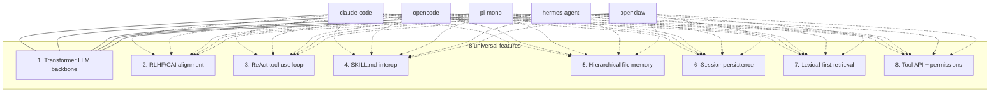

# Most Important Features Modern Agents Share in Common

Synthesizing across [[cross-agent-comparison-2026]] and the five 2026 agent doc sources — [[claude-code]], [[opencode]], [[pi-mono|pi]], [[hermes-agent]], [[openclaw]]. Despite stark differences in tool count (7 → 40), language (TS vs. Python), sandboxing, sub-agent stance, and provider strategy, **all five converge on the same eight load-bearing primitives**.

## The shared substrate

| # | Feature | Why it's universal |
|---|---|---|
| 1 | **Decoder-only [[transformer-architecture\|Transformer]] LLM backbone** | Every agent runs on a [[gpt-4]]/[[claude]]/Gemini-class model. No production agent uses SSM, Mamba, or RWKV. The substrate is not in dispute. |
| 2 | **[[rlhf\|RLHF]] / [[constitutional-ai\|CAI]] alignment baked into the backbone** | Every agent ships against a model post-trained with [[rlhf]] or [[rlaif]]. Refusal behavior, helpfulness, and formatting conventions derive from this layer. |
| 3 | **[[react\|ReAct]]-style tool-use loop** | `Thought → Act → Obs → repeat` is the spine. Every agent's main loop is structurally this, even when the tools differ wildly. |
| 4 | **[[skill-md-format\|SKILL.md]] as de-facto interop standard** | Originated with Anthropic Agent Skills v1; adopted by pi-skills, [[hermes-agent\|Hermes]] (via agentskills.io), [[opencode]] (walks `~/.claude/skills/`), [[openclaw]] (inherits pi's). The closest thing the field has to a cross-vendor standard. |
| 5 | **Hierarchical file memory** | All five auto-load `CLAUDE.md` / `AGENTS.md` / `MEMORY.md` / `USER.md` at session start. Memory-as-files (not memory-as-vector-DB) is the dominant pattern. See [[memory-management]]. |
| 6 | **Session persistence as baseline** | Every agent persists sessions — JSONL tree ([[pi-mono]], [[claude-code]]) or SQLite + event log ([[opencode]], [[hermes-agent]]). Session storage is no longer a feature; it's the floor. |
| 7 | **Lexical-first codebase retrieval** | `grep` / `ripgrep` / `glob` / SQLite FTS5 are the primary retrieval modality. [[dense-retrieval\|Dense vector retrieval]] appears as one optional layer at most (Hermes's `memory-lancedb`), never as the foundation. Code is exact-match-heavy, so [[bm25]]-style lexical wins. |
| 8 | **Tool API + permission layer** | All five expose tools as typed function calls and gate them with some permission system (rule engine, classifier, hooks, sandbox, or human approval). The shape varies; the existence doesn't. |

## What this convergence implies

These eight features are the **2026 baseline for a credible LLM coding agent**. If a system ships without ReAct loops, SKILL.md support, session persistence, or hierarchical file memory, it is not in the same conversation as the field.

Disagreements happen *around* these baselines:

- **Tool count**: maximalist ([[claude-code]] ~40) vs. minimalist ([[pi-mono]] 7) — see [[cross-agent-comparison-2026]] §1.
- **MCP**: in-tree (3 agents) vs. refused (2 agents) — see [[cross-agent-comparison-2026]] §2.
- **Sub-agents**: first-class in [[claude-code]] / [[opencode]] / [[hermes-agent]], **refused** in [[pi-mono]], discouraged in [[openclaw]] — see [[cross-agent-comparison-2026]] §4.
- **Process model**: binary vs. server-with-clients vs. daemon — see [[cross-agent-comparison-2026]] §3.

None of those splits touch the eight universal features.

## Two features that are *not* yet baseline

- **[[mcp|MCP]] (Model Context Protocol)**: split 3 : 2 across the five agents. May become a baseline by 2027, but it isn't one in 2026.
- **Sub-agents / multi-agent orchestration**: [[pi-mono]] explicitly refuses; the others embrace it to varying degrees. The split tracks "how much agency does the system permit itself" rather than a feature gap.

## Where dense retrieval / vector memory sits

Despite a decade of RAG research culminating in [[mem0]], [[a-mem]], and [[mirix]], **[[dense-retrieval|dense retrieval]] is not in the universal baseline**. It appears as one optional layer in some stacks (Hermes's `memory-lancedb`) but is absent from others ([[pi-mono]], [[openclaw]], mostly [[claude-code]]).

The track that *is* universal is the broader [[memory-management]] lifecycle — `write` / `store` / `retrieve` / `compact` / `consolidate` / `evict` / `curate` — not any specific retrieval modality. The 2025–2026 papers ([[memgpt]], [[mem0]], [[a-mem]], [[mirix]], [[sleep-time-compute]]) are about *managing memory*, not *retrieving better*.

## Visualization

## Related queries

- [[from-transformer-to-modern-agents]] — the 9 evolutionary tracks (architecture, scaling, pre-training, alignment, reasoning, retrieval, tool use, orchestration, steering+guardrailing) that compose into modern agents.

## References

- [[cross-agent-comparison-2026]]
- [[cross-agent-comparison-doc-2026]]
- [[claude-code-agent-doc-2026]]
- [[opencode-agent-doc-2026]]
- [[pi-mono-agent-doc-2026]]
- [[hermes-agent-doc-2026]]
- [[openclaw-agent-doc-2026]]
- [[memory-management]]
